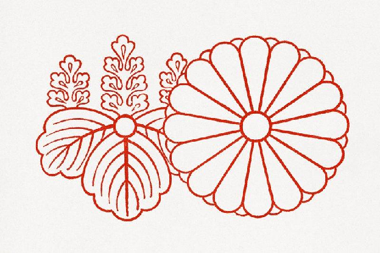

## Inclusive. Practical. Self-contained.

Readers of CLIR publications include cultural stewards at all levels of responsibility and experience. Leaders of memory organizations seek to understand the implications of broader trends and to explore possible strategies for addressing emerging problems. Librarians, archivists, and curators seek to understand how their peers are evolving workflows, practices, and policies over time.

Users of the Field Guides do not just observe and identify elements of pressing challenges; they participate in creating new communities by collectively engaging with the descriptions and recommendations. Each publication in the series is partly a founding document articulating the norms, vocabulary, tools, and values of an emerging commons. Each Guide encapsulates a temporal spectrum: our past (the traditions that are challenged); the present (a description of the challenge and its manageable features), and the future: the beneficial consequence of enabling new systems of response.  

#

| A CLIR Field Guide is:                                                                                                                                                                                                                                                                                                                                                                                                                                                                                                                                                                | A CLIR Field Guide is NOT:                                                                                                                                                                                                                                                                                                                                                                                                                         |
| :------------------------------------------------------------------------------------------------------------------------------------------------------------------------------------------------------------------------------------------------------------------------------------------------------------------------------------------------------------------------------------------------------------------------------------------------------------------------------------------------------------------------------------------------------------------------------------ | :------------------------------------------------------------------------------------------------------------------------------------------------------------------------------------------------------------------------------------------------------------------------------------------------------------------------------------------------------------------------------------------------------------------------------------------------- |
| A set of self-contained, static web pages that are well adapted for use on any networked device and, if possible, downloaded for offline use electronically or in print. A selective, focused, and balanced orientation to an emerging topic or issue with implications for memory organizations and information workers. A forward-looking work designed to inform practice across different types and sizes of memory organizations. A collaboratively authored work that accommodates and responds to the input and suggestions of readers for a set period following publication. | A fully multimedia and interactive web publication that relies on proprietary systems and tools to function. An exhaustive, comprehensive introduction to all dimensions and implications of a topic. A retrospective or summative assessment of a completed project without clearly defined, broad implications for the work of libraries, archives, and museums. A single-authored work that is exhaustively peer reviewed prior to its release. |

#

#
